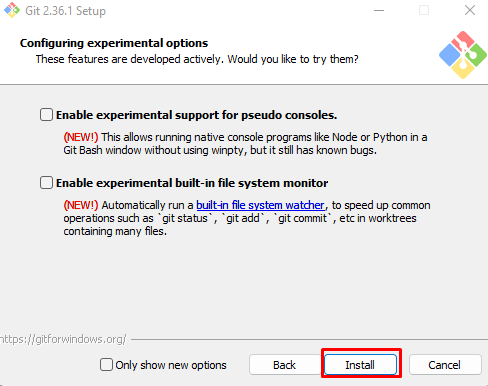

# How to install Git

In order to understand Git first, you need to install it.

Best way is to search "Install Git" on Google and follow the first link to download it.

Choose your Operating System and download accordingly and then proceed with the installation.

Once you have successfully downloaded it, here is the step by step guide on how to install it on system.

1. Click **Next**

2. Select the **Components** you want and click **Next**

3. Select the **Editor** by clicking drop down menu and click **Next**
 
 

4. Leave the setting as default and Click on **Next**
 
 
 
 5. Leave the setting as default and Click on **Next**
 
 

 6. Leave the setting as default and Click on **Next**
 
 
 
 7. Leave the setting as default and Click on **Next**
 
  
 
  8. Leave the setting as default and Click on **Next**
 
  
 
  9. Leave the setting as default and Click on **Next**
 
 
 
 10. Leave the setting as default and Click on **Next**
 
 
 
 11. Leave the setting as default and Click on **Next**
 
 
 
 12. Leave the setting as default and Click on **Next**
 
 
 
 13. Click on **Install**
 
 
 
 14. Click on **Finish**
 
 
 
  After installing, two of these options should be available to you:

 

1. **Git Bash**
   
    Git Bash is CLI (Command Line Interface).

2. **Git GUI**

    Git GUI is, as the name suggests, Graphical User Interface.

Note: This is the example of Windows 10. For MAC or Linux, options would be different but you should be easily able to find them out with little research.

**Note: Visit the original article at [hasabTech](https://article.hasabtech.com/versioncontrolsystem/Git-Basics-In-Nutshell)**

