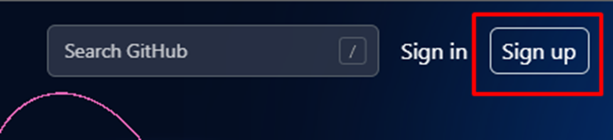
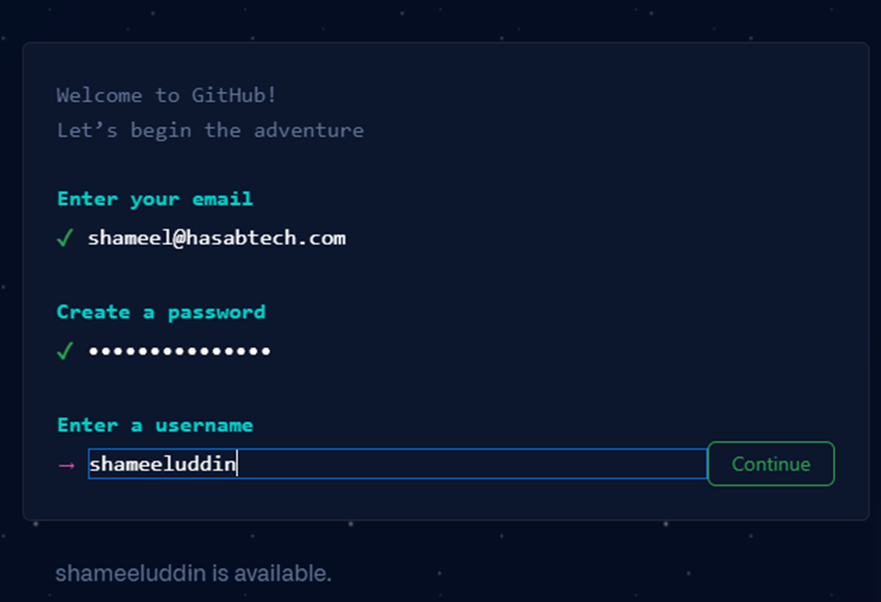
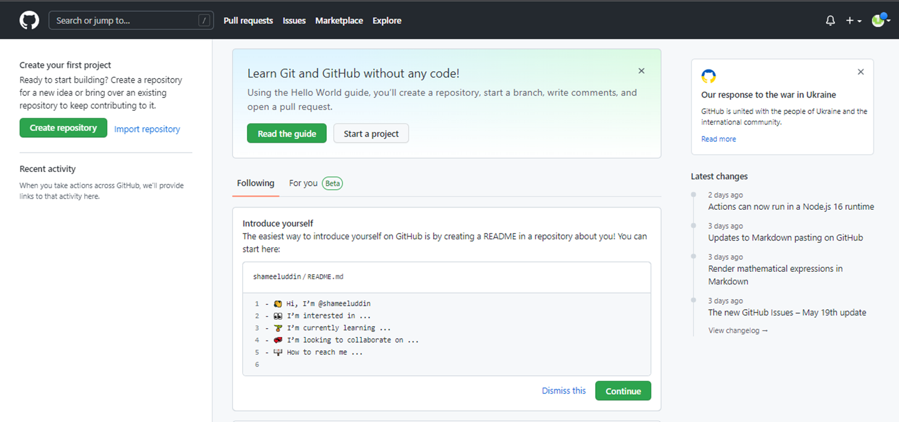
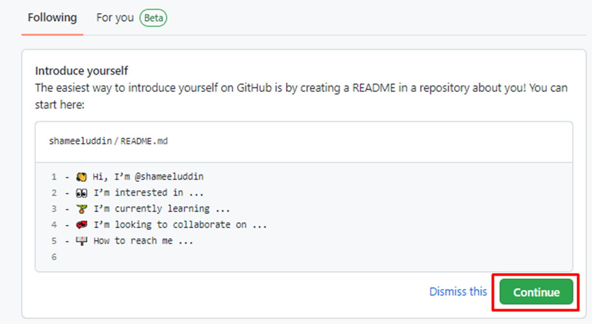
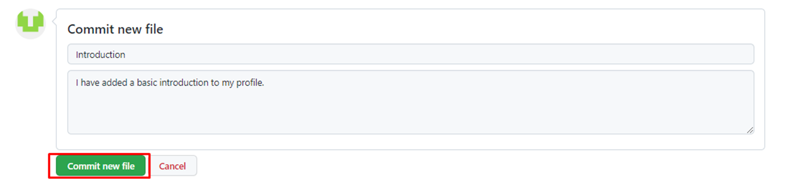
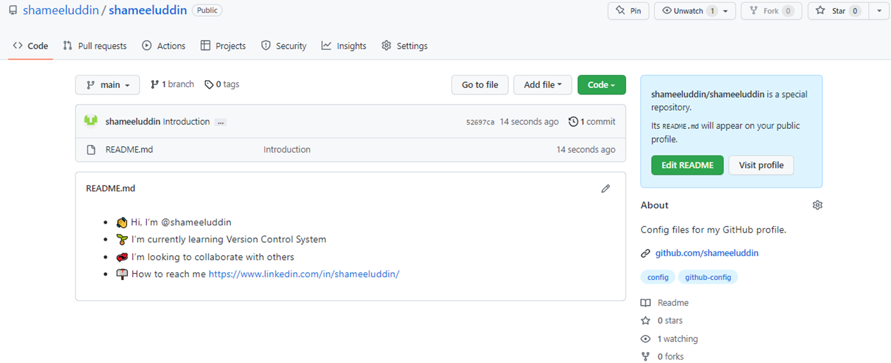

# How to Setup GitHub

Signing up on GitHub is quite easy.

Simply navigate to [https://github.com/](https://github.com/)

1. Click on Signup button at top right.

2. Fill in the information and follow the steps mentioned:

This is how GitHub first appears after you sign up.

## Introduce Yourself
This is one of the steps where you must take some time to introduce yourself in a better way:

Once you click on "Continue" button, it should lead you to edit the Markdown file.

After you are done editing, you can commit your changes.

You should be able to see a page like this with your changes successfully saved:

