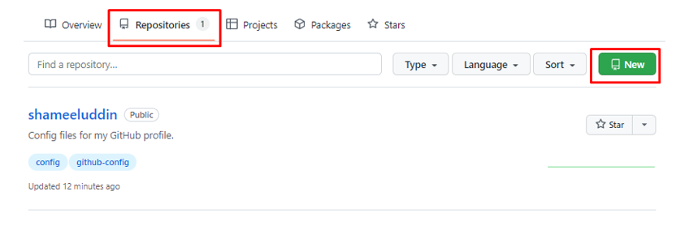
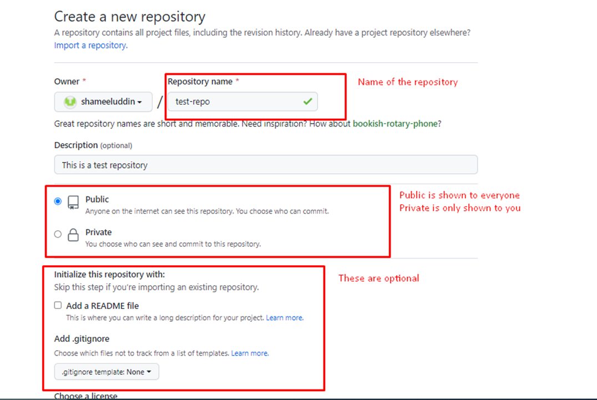
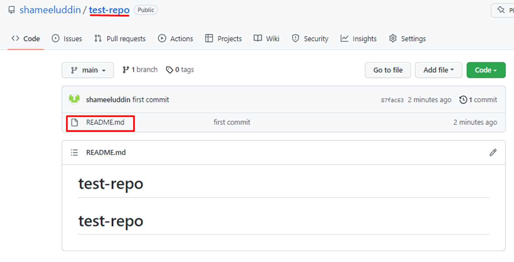

# How to Create Repository on GitHub

Navigate to **Repositories** and click on **New**

Fill out the basic information

Click on **Create Repository**

This is what you see on your GitHub repo page:

**Note: Visit the original article at [hasabTech](https://article.hasabtech.com/versioncontrolsystem/GitHub-Creating-First-Repo)**
