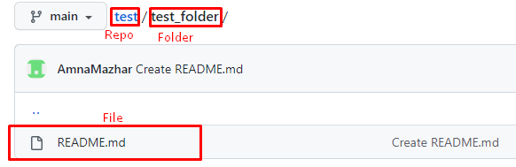

# How to Create a Folder in GitHub Repository

You cannot create an empty folder and then add files to that folder, but rather creation of a folder must happen together with adding of at least a single file. 
This is because git doesn't track empty folders.

## Creating a Folder in GitHub Repository

Here is the step by step guide on how to create a folder in GitHub Repository:

 1. Open **Repository** in which you want to create a folder and click on **Add file** then click on **Create new file**.
 
   
  
 2. Write **folder name** with **slash(/)**.
 
   
 
  After **slash(/)**, you will see a folder name.
 
   
 
 3. Write the **File name** as folder cannot be created empty.
 
   
 
 4. After that, click on **Commit new file**.
 
   
   
  After following all these steps, we wiil be having a folder with a file inside it.
 
   

**Note: Visit the original post on [GitHub](https://github.community/t/add-a-folder/2304)**
 
